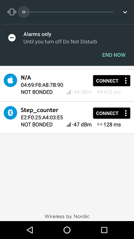
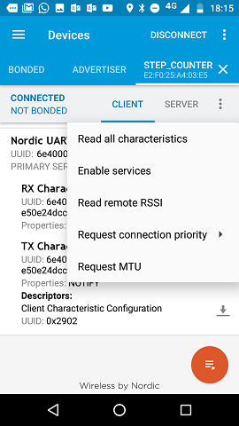
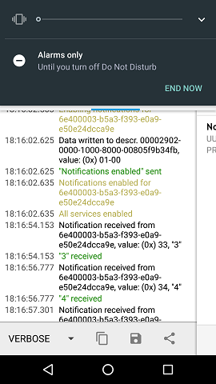

##Description  
nRF dev board connects to smartphone using ble and sending step count, which is detected by Bosch bmi160 IMU

# Instructions
## 1. Power up nRF board
## 2. Start nRF connect application and connect to Step_counter
  

## 3. Select "Enable services" from menu (three dots)
  
<td></td>
## 4. swipe screen and make sure that you have info or verbose selected from lower left corner
 

